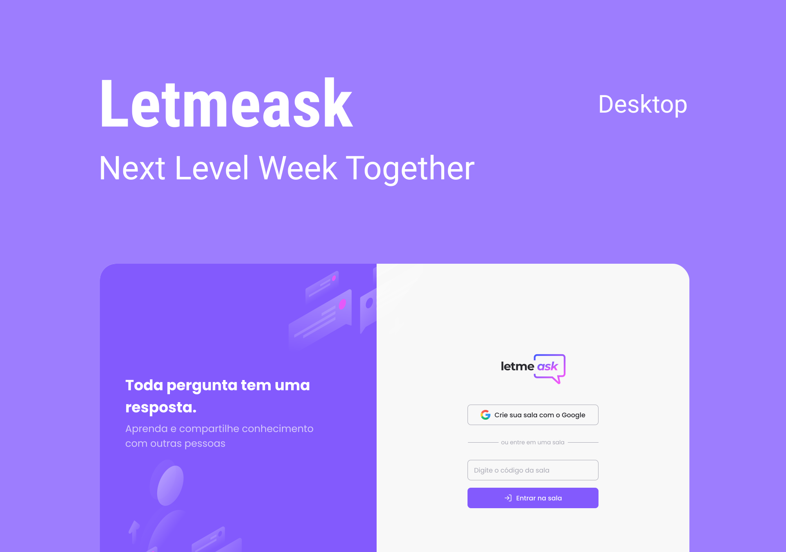

<p align="center">
  
</p>

<p align="center">
  
  
  

  
</p>

<h1 align="center">
    
</h1>

<br>

## 🧪 Tecnologias

Este projeto foi desenvolvido utilizando as seguintes tecnologias:

- [React](https://reactjs.org)
- [Firebase](https://firebase.google.com/)
- [TypeScript](https://www.typescriptlang.org/)

## 🚀 Começando

Clone o projeto e acesse a pasta.

```bash
$ git clone https://github.com/JonathanFerraz/nlw-letmeask.git
$ cd nlw-letmeask
```

Siga os passos abaixo:

```bash
# Instale as dependências
$ yarn

# Comece o projeto
$ yarn start
```

O projeto estará disponível para acesso em seu navegador em http://localhost:3000

## 🔖 Layout

Você pode visualizar o layout do projeto através dos links abaixo:

- [Layout Web](https://www.figma.com/file/KoQ1IVXUIuNZYnsC6HHSSC/Letmeask)

Lembrando que você precisa ter uma conta [Figma](http://figma.com/) para acessá-lo.

## 📝 Licença

Este projeto está licenciado sob a Licença MIT. Consulte o arquivo [LICENSE](LICENSE.md) para obter detalhes.

---

<p align="center">Criado com 💜 por Jonathan Ferraz</p>
